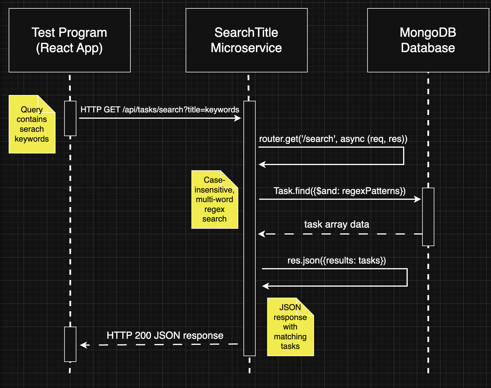

# Search Microservice

## What it does
This microservice provides task search functionality (where tasks are MongoDB documents). Users can search for tasks by typing keywords, and the system finds all tasks that contain those words in the title.

**Key features:**
- Search tasks by title keywords
- Case-insensitive search (finds "Project" when searching "project")
- Multi-word search (finds tasks containing ALL search words)
- Click to expand task details
- Real-time search with Enter key or Search button
- 30 character search limit
- Clear search functionality

## Installation
1. Clone this repo: `git clone [repo-url]`
2. Install backend: `cd backend && npm install`
3. Install frontend: `cd ../frontend && npm install`

## Usage
1. Update the necessary fields in `config.js` (located in root directory)
2. Start the backend: `cd backend && npm run dev`
3. In your main app, import the component:

```javascript
import SearchTitle from '../search-microservice/frontend/src/components/SearchTitle'

function App() {
  return <SearchTitle />
}
```

The SearchTitle component handles all API communication automatically. No additional setup required - just import and use.

## Internal API Reference

The SearchTitle component communicates with the backend using the following API:

**API Endpoint:** `/api/tasks/search`

**Request Format:** GET request with query parameter
```
http://localhost:8080/api/tasks/search?title=search+terms
```

**Response Format:**
```javascript
{
  "results": [
    {
      "_id": "64f8a1b2c3d4e5f6789a0b1c",
      "title": "Study for Exam",
      "description": "study for CS 361 final",
      "group_name": "School Tasks", 
      "date": "07-26-25",
      "priority": 1
    }
  ]
}
```

*Note: This API information is for reference only. The SearchTitle component handles all API calls internally - you don't need to make these requests manually.*

## UML Sequence Diagram
